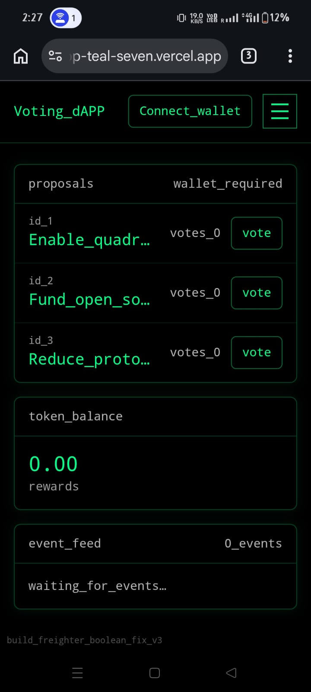

# Voting dApp (Soroban + React)


Terminal-style decentralized voting app on Stellar **Soroban** (Testnet), with **reward tokens** via inter-contract calls and a **real-time event feed**.

## Monorepo structure
- `contracts/`: Soroban smart contracts (Rust)
- `frontend/`: React + Vite UI
- `scripts/`: deploy/init scripts (local + CI friendly)

## Architecture (high level)
- **Voting contract**: stores proposals + one-vote-per-wallet guard; emits `vote_cast`; calls token `mint` atomically.
- **Token contract**: SEP-41-style primitives (`balance`, `transfer`, allowances) plus admin `mint`; emits `tokens_rewarded`.
- **Frontend**: Freighter wallet connect + Soroban RPC integration; event feed polls `getEvents` with cursor pagination + dedupe.

## Quickstart

### Prereqs
- Node.js 20+
- Rust toolchain
- Soroban CLI (installed + configured for Testnet)
- Freighter wallet (browser extension)

### Frontend
```bash
cd frontend
npm install
npm run dev
```

### Contracts
```bash
cd contracts
cargo test
```

## Frontend environment variables
- `VITE_SOROBAN_RPC_URL` (default: `https://soroban-testnet.stellar.org`)
- `VITE_VOTING_CONTRACT_ID` (after deploy)
- `VITE_TOKEN_CONTRACT_ID` (after deploy)
- `VITE_EVENT_START_LEDGER` (optional; default `0`)

## Deployment
CI runs contract formatting, contract tests, WASM builds, and the frontend production build on every push and pull request. Production deploy runs from `main` when the required Vercel and contract secrets are configured.

After first deploy, update this README with:
- Live demo link
- Contract IDs + tx hashes (Voting + Token)
- Mobile screenshots

See [scripts/deploy.testnet.md](scripts/deploy.testnet.md).

## Contract addresses(after deployed)
- **Voting contract**:CDFQGFT67QKECWMPM7IXVN47YFIBIX6DCZRQ7LO57C2GTCPJVMJFTMP6
- **Token contract**: CD322LQ4MUWPUTMGPSL2IGRSHDRIZKWTFT4PAZZTUD2FK4ILCYRQTQCF
- **Deploy tx hash**:170b9bdb3ec64d2de980c0b59eb25f3ac0aae1f23e8b0290223e97353a3ffaaa

## SCREENSHOT OF MOBILE RESPONSIVE 

## LIVE DEMO LINK OF VERCEL:-https://voting-dapp-teal-seven.vercel.app/

## SCREENSHOT OF CONTRACT ID - 

## WORKING APP SCREENSHOT -  


